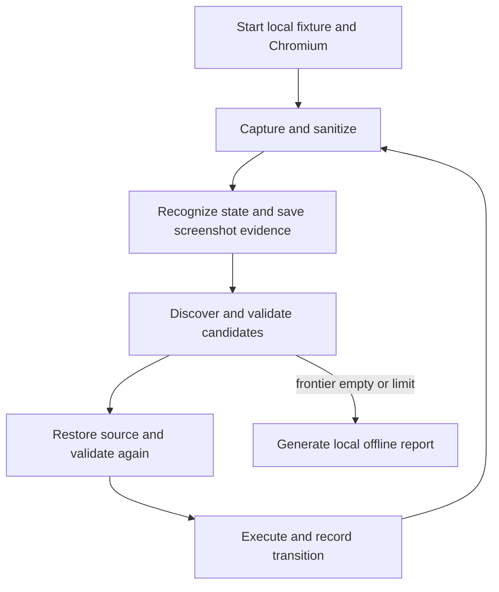

# M1 browser

```mermaid
flowchart TD
  A["Start local fixture and Chromium"] --> B["Capture and sanitize"]
  B --> C["Recognize state and save screenshot evidence"]
  C --> D["Discover and validate candidates"]
  D --> E["Restore source and validate again"]
  E --> F["Execute and record transition"]
  F --> B
  D -->|"frontier empty or limit"| G["Generate local offline report"]
```
See [codebase](../architecture/CODEBASE_MAP.md) and [tests](../testing/TEST_MAP.md).
